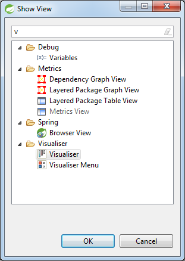
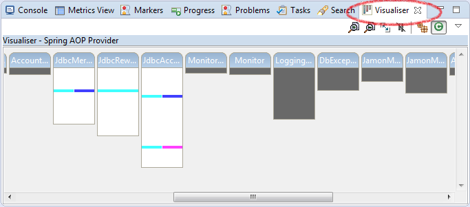
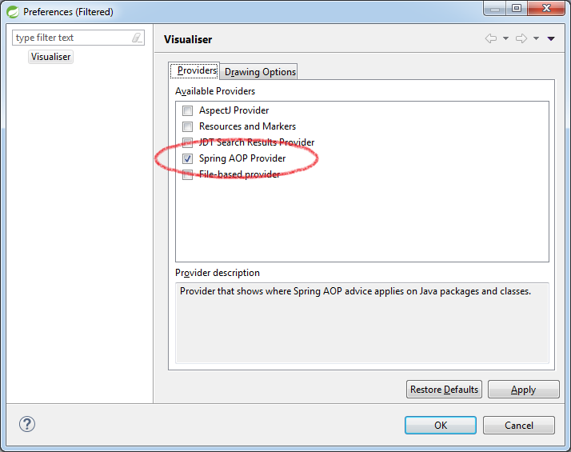

# AOP with Spring (`aop-1`)

In this lab you will gain experience with aspect oriented programming (AOP) using the Spring AOP framework. You'll add cross-cutting behavior to the rewards application and visualize it.

What you will learn:

1. How to write an aspect and weave it into your application

Estimated time to complete: 35 minutes

---

## Bean Support in Eclipse/STS

TODO Provide instructions on how to enable Eclipse/STS to detect Java-based configuration files and the beans defined in them. This, in turn, enables the Visualiser to detect Spring AOP provided advises on Java classes.

## Visualiser view in Eclipse/STS

To visualize aspects, use the Visualiser view in Eclipse/STS. If not already displayed, click on `Window -> Show View -> Visualiser`. If you can't see the Visualiser view, try clicking `Other ...` and looking under `Visualiser`.

To enable Spring AOP provided advises on Java classes, click a down arrow icon in the upper left corner of the view.

Then, go to `Preferences...`. In the pop-up dialog, select `Spring AOP provider`.

 