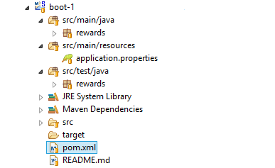

# Introduction to Spring Boot (`boot-1`)

In this lab you will gain experience with building a Spring Project using Spring Boot.

What you will learn:

1. How to develop a Spring MVC web application using Spring Boot
2. How to configure a Spring Boot project

Estimated time to complete: 30 minutes

## General notes about this lab

This lab is different than all the other labs you have done so far. In this lab, you start with just a minimal Spring Boot application and build on it. **There are no TODO items in this lab.** Instead there is just one set of instructions - you are reading them!

## Lab instructions

Here is the outline of this lab. Details of each are provided below.

1. Inspect the Spring Boot project
2. Verify everything is working
3. Start the application
4. Create a simple "Hello" controller and web page
5. Add database, initial data, and reward account for purchase
6. (Bonus) Add Devtools
7. (Bonus) Add Actuator (metrics)

### Inspect the Spring Boot project

The `boot-1` project we provide looks like this:

Look at what a Spring Boot project looks like:

- The standard Java / Maven project folder structure.
- A Maven build file. Boot works perfectly well with Gradle but this lab environment is established for Maven.
	- Open the Maven build file (`pom.xml`) and click on the `pom.xml` tab on the bottom of the editor.
	- Unlike a typical Spring Boot project, it *does not* have `spring-boot-starter-parent` as its parent, because all the labs in this course already inherit from our course parent POM. However you will find the Web starter, `spring-boot-starter-web`.
- A simple JUnit test class (`BootLabApplicationTests.java`)
- A Bootstrap class (`BootLabApplication.java`)
	- This class contains the main method needed to start a Spring Boot application.
	- The single `@SpringBootApplication` annotation is a meta-annotation combining the `@Configuration` , `@EnableAutoConfiguration` , and `@ComponentScan` annotations.

### Verify everything is working

You already have a working Spring Boot application now. You can test your project by executing the
`BootLabApplicationTests` using JUnit. Run the test and make sure it passes.

### Start the application

Your application is now ready to start. But first, make sure you don't have a server running from a previous lab. If you do, stop it; it will cause a conflict on port 8080 if it is still running.

*When running a Spring Boot web-application, if you get an error about the Tomcat Connector in a failed state it just means the port is already in use.*

A Spring Boot web application can run in any web container compliant with the Servlet 3.0 API, but we will run our project as a standard Java application. The application can run from the IDE, we don't have to package it in any way, launching a main class will do the trick! Right-click on the `BootLabApplication` and select "Run As > Spring Boot Application". Once running, open `http://localhost:8080` in your browser. You should get a 404, as we haven't created anything yet.

*When running outside of a container, there is no need to specify the application's context in the servlet container, since there is only one application. This is why the URL is not* `http://localhost:8080/boot-1`.

*Spring Boot packages the embedded Tomcat JARs to allow it to run without a container. If you never intend to run outside of a container, you can simply exclude these JARs using Maven/Gradle.*

### Create a simple "Hello" controller and web page

Now create a new Spring MVC controller in the package `rewards`. You can pick any name for your controller class, as long as it resides in the `rewards` package.

The controller should only contain one method which is mapped to `/hello` and should return the String "hello".

Next, we'll need a web page to display. Navigate to `src/main/webapp` and create a `WEB-INF/views` folder structure. Within the `views` folder create a file named "hello.jsp". Within this file, add the text *"Hello World from a JSP page!"* - we don't need a formal web page, just something to confirm that all the pieces are working together. Save your work.

Next, you may recall from Spring MVC that we typically need an `InternalResourceViewResolver` setup. Spring Boot will take care of this for us, but does not know what to use for prefix and suffix. Boot has a default property file called `application.properties` that we can use to configure this kind of thing very easily. Open this file (it's located at `src/main/resources`) and add the following lines:

	# Control the InternalResourceViewResolver:
	spring.mvc.view.prefix=/WEB-INF/views/
	spring.mvc.view.suffix=.jsp

Next, open the `pom.xml` file and check the following dependencies are set up:

	<!-- These dependencies enable JSP usage -->
	<dependency>
		<groupId>org.apache.tomcat.embed</groupId>
		<artifactId>tomcat-embed-jasper</artifactId>
	</dependency>
	<dependency>
		<groupId>javax.servlet</groupId>
		<artifactId>jstl</artifactId>
	</dependency>

As mentioned in the comment, these dependencies enable JSP web applications, which is not straightforward when running outside of a container. Save your work, stop the application (big red button in the console view), and start it again. Open [http://localhost:8080/hello](http://localhost:8080/hello). You should see `Hello World from a JSP page!`

At this point we have a working web application. Next we will add the same infrastructure we used in previous labs to have a full-fledged application.

### Add database, initial data, and reward account for purchase

In this section, we will add a database, set-up some initial data, and the reward purchase objects that we used in prior labs. Then we will copy the JSPs and controllers from the last lab and re-create the online rewards system.

**Add additional dependencies**

Open the `pom.xml` file and check the following dependencies are set up:

	<!-- These dependencies enable JPA and an in-memory DB -->
	<dependency>
		<groupId>org.springframework.boot</groupId>
		<artifactId>spring-boot-starter-data-jpa</artifactId>
	</dependency>
	<dependency>
		<groupId>org.hsqldb</groupId>
		<artifactId>hsqldb</artifactId>
	</dependency>

1. `spring-boot-starter-data-jpa` - This is a "Starter" POM that defines a typical set of dependencies needed to work with JPA. This single dependency eliminates the need for us to define more than 10 separate dependencies related to Spring ORM, JPA, and Hibernate.
2. `hsqldb` - This is the HSQL in-memory database. On startup, Spring Boot will notice this JAR, notice that we have not defined a `DataSource`, and will define one for us.

Now, we need the classes that we have been working with throughout this course. Copy the following packages from a previous lab (`mvc-1`):

- `rewards.application`
- `rewards.domain.model`
- `rewards.infrastructure.jdbc`
- `rewards.infrastructure.jpa`

Do not copy `rewards.config` and `rewards.web`.

Back in the current lab (`boot-1`), remove the extraneous `JdbcAccountRepository` and `JdbcMerchantRepository` classes from the `rewards.infrastructure.jdbc` package. We only need one implementation - `JpaAccountRepository` and `JpaMerchantRepository` classes will do.

*An alternative would be to just remove or comment out the* `@Repository` *annotation from the said* `Jdbc*` *classes.*

In order to work with our `Account`, `Card`, `Merchant` entities, we will need to tell Spring Boot where our JPA annotated classes are.

*One interesting thing to note at this point is that we do NOT need to define a* `DataSource`*,* `TransactionManager`*, or JPA* `EntityManagerFactory` *- Spring Boot will deduce that we need these, based on the fact that we have JDBC data source and JPA JARs on our classpath!*

We will also need the SQL schema and initialize it with some data. For this, copy the `rewards` folder under `src/test/resources` from `mvc-1` (a previous lab) to `src/main/resources` in `boot-1` (this current lab). This copies the needed SQL scripts.

Next, open `application.properties` again and add the following lines:

	# Control how Boot loads data when it starts:
	spring.jpa.hibernate.ddl-auto=none
	spring.datasource.schema=classpath:/rewards/testdb/schema.sql
	spring.datasource.data=classpath:/rewards/testdb/test-data.sql

1. `spring.jpa.hibernate.ddl-auto` - Instruction to Hibernate on what its policy should be regarding automatically creating database tables based on annotated classes. Ordinarily it tries to do this for us when using an in-memory database, so we are asking it not to.
2. `spring.datasource.schema` / `data` - Locations of any SQL files to be executed on application startup.

Before going further, let's make sure the last few steps were done correctly. Save all your work and restart your application. Open [http://localhost:8080/hello](http://localhost:8080/hello). You should still see `Hello World from a JSP page!`. If you do not, you probably made a mistake on one of the previous steps. Be sure the application starts before proceeding. In the next section, we will add the form to reward an account for given purchase.

**Add web presentation-layer artifacts**

Next, we want to re-create the reward account page from the MVC lab (`mvc-1`). Rather than create them from scratch we will simply copy most of this.

COPY the following files / folders from the `mvc-1` project:

1. Copy the `rewards.web.RewardController` class to our `boot-1` project
2. Copy `index.jsp` and `reward.jsp` of `webapp/WEB-INF/views` folder to the `webapp/WEB-INF/views` folder in `boot-1` project

Save all your work and restart your application. Open [http://localhost:8080/](http://localhost:8080/).

You should see the reward account page from the last lab.

**Congratulations, you have completed this lab!** But before moving on, consider all of the items that you did NOT have to do, because Spring Boot did them for you:

1. You did NOT define a dataSource - Spring Boot noticed that you did not, and noticed HSQL on the classpath, and created one for you.
2. You did NOT define an `EntityManagerFactoryBean`, or a `JpaVendorAdapter` - Spring Boot noticed a JPA implementation on the classpath and set this up for you, using the `DataSource`.
3. You did NOT define a `PlatformTransactionManager` - Spring Boot assumed you would need one when working with JPA.
4. There is no `web.xml` file. Spring Boot is using a Servlet Initializer.
5. You did NOT define the `DispatcherServlet`, or a Servlet Mapping - Spring Boot noticed Spring MVC JARs on the classpath and defined this for you.
6. You did NOT define an `InternalResourceViewResolver` - Spring Boot did this for you, and allowed you to easily define the prefix and suffix.

### (Bonus) Add Devtools

One of the biggest problems when dealing with Java application in general is that, every time we change a Java class (for example the *controller*), we need to manually restart the JVM process (or redeploy to web container). In order to make the development experience more pleasant, we are introducing the Spring Boot Devtools.

Devtools will monitor the application's classpath, and reloads the application automatically.

Now, we need to add a dependency to our `pom.xml` file. Check the following dependency is set up in the POM:

	<dependency>
		<groupId>org.springframework.boot</groupId>
		<artifactId>spring-boot-devtools</artifactId>
	</dependency>

Now start the application ("Run as > Spring Boot Application"). Once it is started, navigate to the hello page ([http://localhost:8080/hello](http://localhost:8080/hello)). So let's change the "HelloController" by changing its return value from "hello" to "index":

	@RequestMapping("/hello")
	public String home() {
		return "index";
	}

When you save the changes, you should notice that STS output tab starts printing some new log entries. Now, go refresh the hello page ([http://localhost:8080/hello](http://localhost:8080/hello)), instead of "Hello World from a JSP page!", we see the reward account form page!

### (Bonus) Add Actuator (metrics)

Now let's use Spring Boot Actuator to get some runtime information. To enable the Actuator, we just need to add a dependency for it to our pom.xml file. Check the following dependency is set up in the POM:

	<dependency>
		<groupId>org.springframework.boot</groupId>
		<artifactId>spring-boot-starter-actuator</artifactId>
	</dependency>

There are several Spring Boot Actuator URLs, such as:

- The Spring Beans: [http://localhost:8080/beans](http://localhost:8080/beans)
- Environment: [http://localhost:8080/env](http://localhost:8080/env)
- Controller mappings: [http://localhost:8080/mappings](http://localhost:8080/mappings)

For more details, refer to the Actuator section of the Spring Boot documentation.

**Congratulations, you have completed the bonus sections of this lab!**
