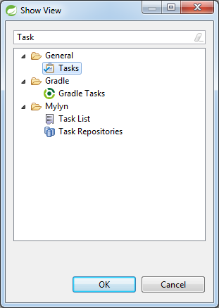
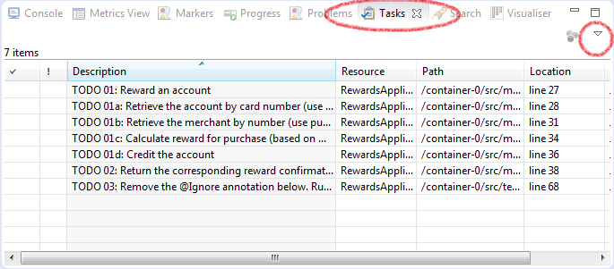
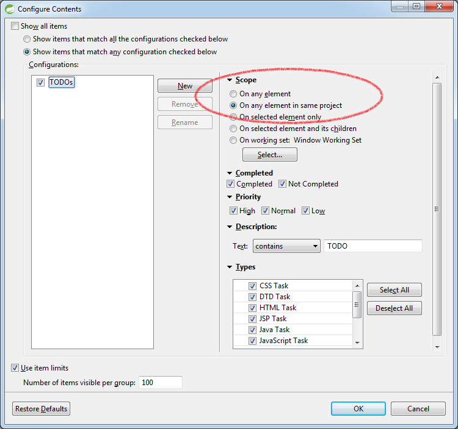

# Introduction to Core Spring (`container-0`)

Welcome to Core Spring! In this lab you'll come to understand the basic workings of the Rewards reference application.

What you will learn:

1. Basic features of the Spring Tool Suite
2. Core Rewards Domain and API
3. Basic interaction of the key components within the domain

Estimated time to complete: 30 minutes

In the next labs, you will often be asked to work with TODO instructions. They are displayed in the Tasks view in Eclipse/STS. If not already displayed, click on `Window -> Show View -> Tasks` (be careful, not `Task List`). If you can't see the Tasks view, try clicking `Other ...` and looking under `General`.

By default, you see the TODOs for all the active projects in Eclipse/STS. To limit the TODOs for a specific project, go to `Tasks` view, and click a down arrow icon in the upper left corner of the view.

Then, go to `Configure Contents...`. In the pop-up dialog, select `On any element in same project`.

**Caution:** It is possible, you might not be able to see the TODOs defined within the XML files. In this case, you can check the configuration in `Preferences -> General -> Editors -> Structured Text Editor -> Task Tags` pane. Make sure `Enable searching for Task Tags` is selected. On the Filters tab, verify if XML content type is selected. In case of refresh issues, you may have to uncheck it and then check it again.
