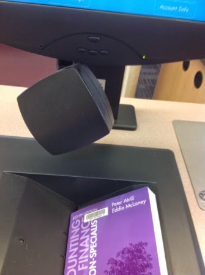
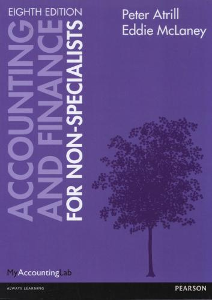
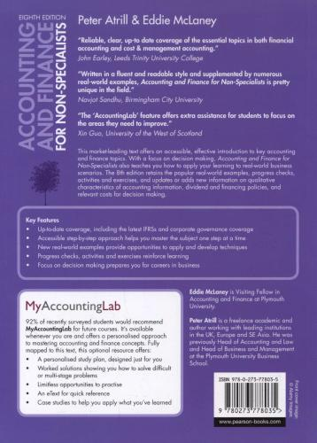

This machine problem involves using Spring Framework (Core) and JPA (Hibernate). The HSQL in-memory database shall be used for this.

A service facade and an integration test are provided as a guide. You'll need to define classes (mapped as entities) with corresponding associations and operations, and make all the tests pass. In doing so, you **cannot** modify [BorrowingServiceFacade](src/main/java/libraryapp/interfaces/BorrowingServiceFacade.java) and [AbstractBorrowingServiceFacadeTests](src/test/java/libraryapp/interfaces/AbstractBorrowingServiceFacadeTests.java).

**Estimated time to complete: 180 minutes**

### Library Book Borrowing System 

The system to build is an automated library book borrowing system that is to be used in the departmental libraries of a university. The goal is to relieve the librarians from processing book loans.

The system **does not** require users to identify themselves to search for books according to certain criteria and to check the availability of a particular book. However, to check-out books, to check their respective book loan status, and to place holds on books that are already on loan, users must first identify themselves to the system.

A single receipt is printed for each user check-out session; it details for each book: the title of the book, the unique identifier of the book, the date the book was borrowed, and the date the book is to be returned by.

Books have physically attached barcodes, which are used for the identification of books that are checked out (a barcode scanner is to be used). If the book does not scan, it should be also possible to enter the barcode manually. Book renewals (i.e., extending the due date) are not supported in the current version of the system, but this feature is planned for a later release. It is perceived as an important feature to be supported via the web.

These are the borrowing rules:

- Each user has a maximum number of books that are allowed to be on loan at any one time. The limit is dependent on the category of the member, e.g. department heads can take out as many as 100 books, where research assistants are limited to 15 books.
- Often, a certain category of book a different loan period for each category of member, e.g. professors are allowed to borrow a standard book for 6 months, whereas graduate students are allowed only 3 months.
- Different categories of books have different loan periods (e.g., lecturers may borrow a standard book for 3 months, but can only loan a periodical for 1 month). It might even not be possible, for a certain category of
member, to borrow certain books (e.g. undergraduate students cannot borrow reference books).
- Books that are on reserve are not available for loan.

To further clarify, the library intends to add its own unique barcode on the book (as illustrated in the photos). This unique barcode is *different* from the book's ISBN (which is usually printed in barcode format at the back). The library's unique barcode allows it to differentiate between copies of the same book title.

The unique barcode shall be placed on the front cover.

This is **NOT** the ISBN at the back.

The above are photos of the following book:

 
